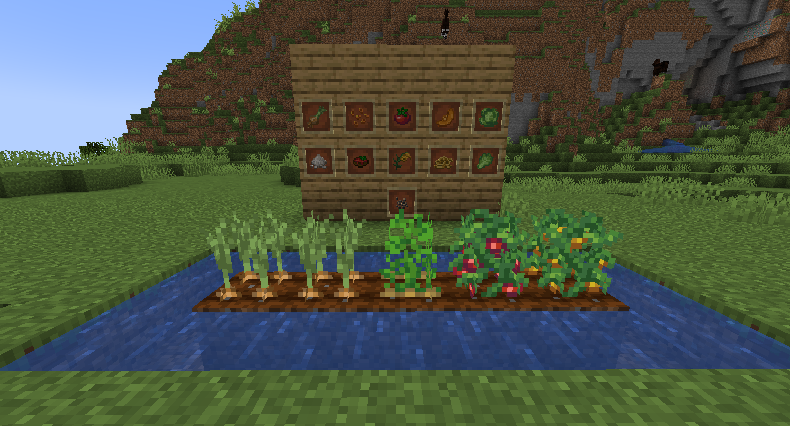

# FarmersDelightRepaper —— Farmer's Delight Reimplementation for PaperMC 

[中文版](README_ZH.md)

> A Paper server mod developed using Ignite framework, aiming to recreate core features of "[Farmer's Delight](https://modrinth.com/mod/farmers-delight)" through pure server-side implementation without requiring client mods.



## 🌟 Features

- **Zero Client Mod Dependency**：All features implemented server-side, compatible with vanilla clients (ResourcePack needed!)
- **Hybrid Architecture**：Combines Paper plugin with Mixin technology
- **Dynamic Data Storage**：Hijacks vanilla block states for crop data storage (No NBT required)
- **Extensible Framework**：Simple implementation with high expansion potential

## 🛠️ Technical Implementation

### Development Environment
- **Ignite + Paper**：Mixin environment built on [Ignite](https://github.com/vectrix-space/ignite)
- **Hybrid Development**：
  - `/plugin` - Paper plugin (Item registration/event handling)
  - `/Ignite-mod` - Core Mixin modules
- **Gradle Build**：
  ```bash
  # Full project build
  ./gradlew build

  # Build modules separately
  ./gradlew :plugin:build
  ./gradlew :Ignite-mod:build
  ```

### Core Mechanics
- **Crop Implementation**：
    - Stores growth stages in `BlockState`
    - Overwrites random ticks and crop logic via Mixin for native-level bone meal interaction
    - Implements physics through plugin behavior modifications
    - Achieves full visual effects with client-side resource pack support

### Limitations
- Hijacking the `BlockState` of Pink Flower Clusters causes naturally generated Pink Flower Clusters to only face NORTH
- Some added crops are fewer in quantity compared to the original mod's implementation stage
- ~~Yet to be discovered limitations~~

## 📌 Current Progress

| Module                  | Progress | Description                                                          |
|-------------------------|----------|----------------------------------------------------------------------|
| **Crop System**         | 🚧 75%   | Implemented planting/growth logic for onions, cabbages, and tomatoes |
| **Item System**         | 🚧 50%   | Partial item registration completed, recipes not yet implemented     |
| **Interactive Cooking** | ⭕ 30%    | Partially implemented GUI-based chopping board                       |
| **New Mechanics**       | ⭕ 0%     | Development not yet started                                          |

## 🚧 Collaboration

Contributions welcome! Priority areas:

**TODO List**:
- [ ] Add multiple items and crafting recipes from original mod
- [ ] Improve crop system mechanics
- [ ] Implement kitchenware interactions
- [ ] ~~Find bugs~~ Write unit test cases

**Guidelines**:
1. Maintained by new developer - Mixin code may need optimization ~~(Overwrite abuse alert)~~
2. Please run `./gradlew check` before submitting PRs

## 📜 License

Licensed under **[GNU GPLv3](LICENSE)**. You must:
- Keep derivative works open source
- Preserve original author attribution
- Share modified source code

## 💬 Contact

Submit issues or email: [MoYuOwO@outlook.com](mailto:MoYuOwO@outlook.com)